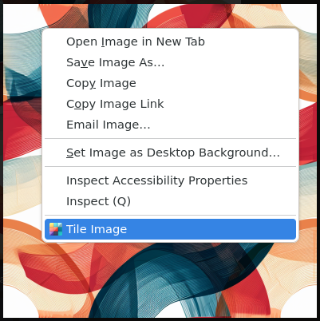
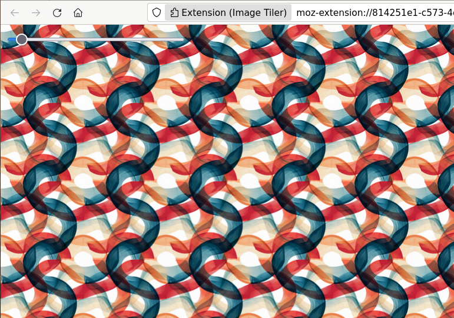

# ImageTile-Firefox
Firefox extension for viewing images as tiled page.

Features a slider for adjusting the size of the tile.

I was inspired by the Chrome extension `Tile View`. 

Similar functionality and ease of use. Slightly different asthetic. 

